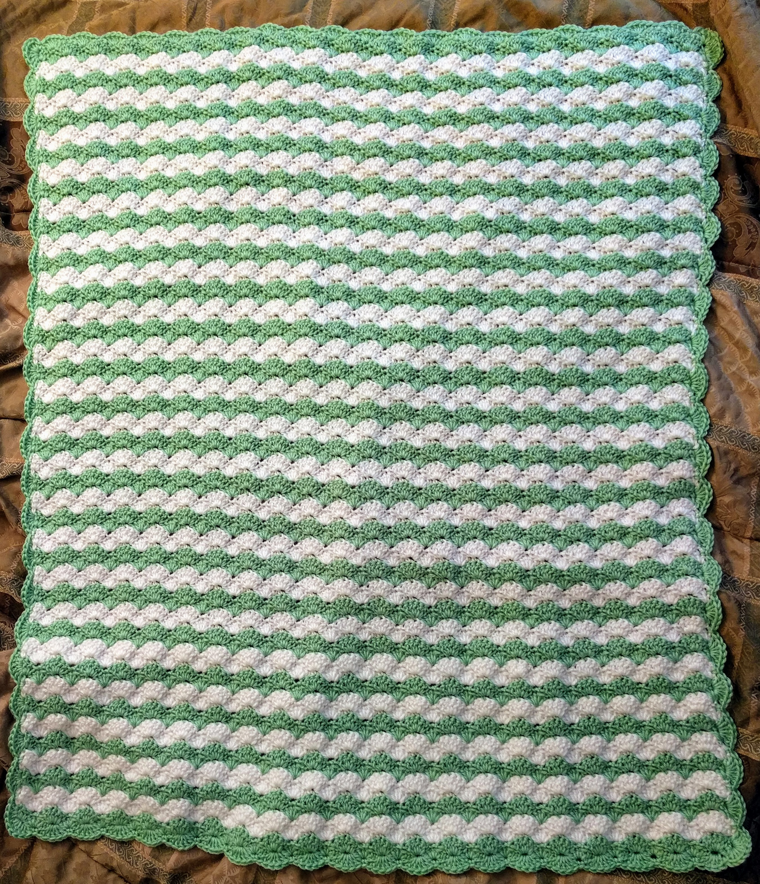
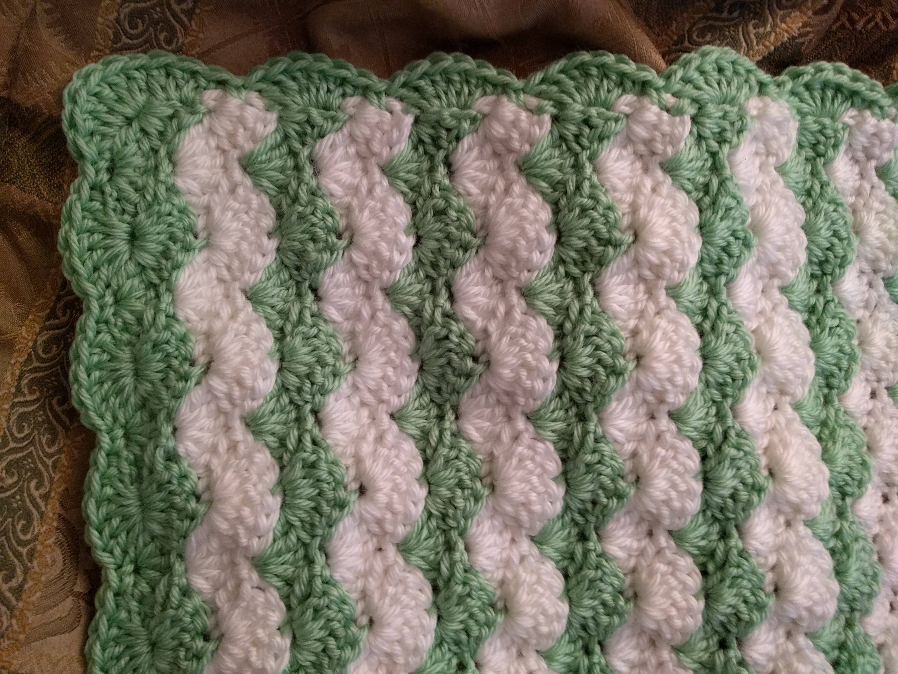

# Welcome to Kirby's Korner!
**Side Note: This is just a test page**

We're gonna crochet a blanket today!

## How to make a blanket:

- Grab a hook and some yarn
- Watch hundreds of hours of YouTube tutorials! 

What? That's how I did it...

**Well, good luck!** 

_Just kidding, it's gonna take some time._

Here's a blanket that I made recently:

